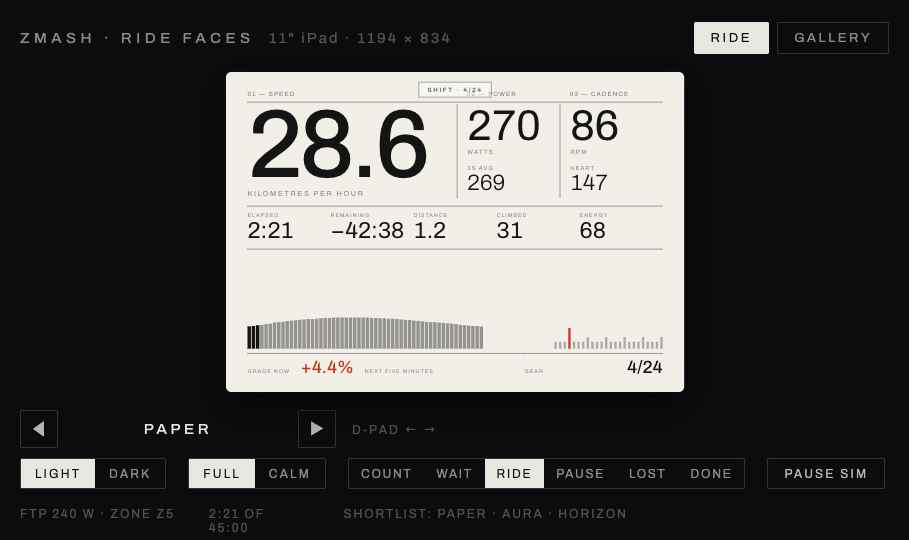

# Zmash

An iPad app for indoor cycling. It connects to a Zwift Ride controller and a smart trainer over Bluetooth and shows your ride on a full-screen display. It handles virtual shifting and gradient on its own, without Zwift and without a subscription.



It's a personal project, built for a Wahoo KICKR CORE 2 and a Zwift Ride (firmware 1.2.0) on an iPad in landscape.

## What it does

- **Live numbers:** speed, power, cadence, heart rate, time, distance, calories and climbing.
- **Speed that behaves like a bike:** speed comes from a physics model that accounts for your weight, the gradient and air resistance, so you accelerate, coast and slow down realistically.
- **Virtual shifting:** shift with the Ride's paddles and buttons. You can choose 3 to 24 gears.
- **Gradient control:**
  - *Manual:* set the gradient with the D-pad.
  - *Auto:* ride a generated course. Pick its length, terrain type and effort, and you can re-roll it.
- **Faces:** choose how the ride screen looks, the way you'd pick a watch face.
  - Five designs: Paper, Aura, Night, Horizon and Kinetic, plus a Classic dashboard.
  - Every face can be customised: pick its palette and which numbers it shows.
  - Switch faces mid-ride with the D-pad.
- **Workouts:**
  - A built-in library of structured workouts, including a ramp test.
  - Imports Zwift `.zwo` workout files.
  - The trainer can follow each target in ERG mode, or the targets become gradients.
  - An FTP estimate from your rides, and a ramp test if you want to measure it.
- **Routes:**
  - Ride by distance on a real elevation profile instead of a clock.
  - Imports GPX and FIT files, and includes approximate profiles of Alpe d'Huez, Ventoux, Stelvio, Tourmalet and Mortirolo.
  - Race the ghost of your quickest previous attempt.
- **History:**
  - Every ride is saved on the iPad, with a list and a calendar view.
  - Each ride has charts, and a Progress tab with your power curve, weekly load and weekly time.
  - Share a ride as a card.
- **Export:** FIT files for anything that reads them, Apple Health, and direct upload to Strava and intervals.icu with your own account.
- **Picture in Picture:** keep your numbers in a floating window while you watch something else on the iPad.
- **Remappable controls:** every Ride button can be reassigned.
- **Diagnostics:** export a connection log from Settings.

## Hardware

| Device | How it connects |
|---|---|
| Zwift Ride (also Zwift Play and Click) | Zwift's controller protocol |
| Wahoo KICKR CORE 2, or any FTMS smart trainer | FTMS (standard), or Zwift's trainer protocol where supported |
| Heart-rate strap | Standard Bluetooth heart-rate service |

The Zwift Ride can only be connected to one app at a time, so close Zwift (and Zwift Companion) before riding with Zmash. Newer Ride firmware may change the protocol, so this app is tested with firmware 1.2.0.

There's also a demo mode, which simulates a trainer and a rider so you can try the app without any hardware.

## Building

You need:

- a Mac with Xcode 16 or later;
- [XcodeGen](https://github.com/yonaskolb/XcodeGen) (`brew install xcodegen`);
- an iPad running iPadOS 18 or later.

```sh
make test          # run the unit tests (protocols, physics, workouts, FIT export)
make build-sim     # build for the iPad Simulator (the demo mode runs there; Bluetooth doesn't)
make devices       # list connected devices to find your iPad's identifier
make install DEVICE=<id>   # build, install and launch on the iPad
make open          # generate the Xcode project and open it
```

To install on your own iPad, set `DEVELOPMENT_TEAM` in `project.yml` to your own team. A free Apple account works. Apps signed that way stop launching after 7 days, and running `make install` again renews them.

## Project layout

```
Zmash/                 the iPad app (SwiftUI)
  Devices/             Bluetooth: controllers, trainer, heart rate, demo devices
  Session/             the live ride: timing, physics, trainer control, Picture in Picture
  UI/Faces/            the ride-screen faces
  Persistence/         saved rides (SwiftData), Apple Health export
Packages/ZmashKit/     protocol decoding, physics, gears, terrain, workouts, FIT writer, with tests
design/                the face designs the app is built from
```

Most of the logic lives in `ZmashKit`, a plain Swift package that is tested on the Mac without a device.

## Documents

- [BRIEF.md](BRIEF.md): the original spec. It covers the protocols, the physics and every screen.
- [DESIGN.md](DESIGN.md): the brief for the ride-screen faces.
- [DECISIONS.md](DECISIONS.md): the decisions made along the way, and why.
- [ROADMAP.md](ROADMAP.md): what's done and what's next.

## Credits

The protocol details come from public write-ups of the Zwift Ride and Zwift trainer protocols, and from the Bluetooth FTMS specification. No code from other projects is included.

The fonts (Archivo, Newsreader, Outfit, Roboto Flex) are used under the SIL Open Font License, and the icons come from [Lucide](https://lucide.dev).

Not affiliated with Zwift or Wahoo.
