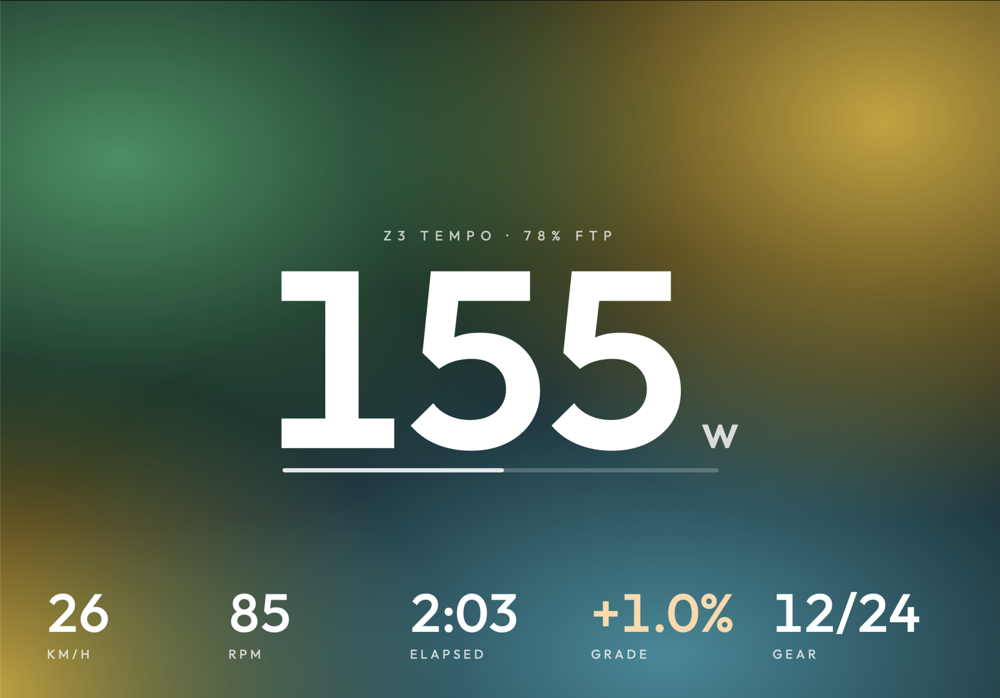

# Zmash

An app for indoor cycling, made for the iPad and also running on iPhone and Mac. It connects to a Zwift Ride controller and a trainer over Bluetooth and shows your ride on a full-screen display. It handles virtual shifting and gradient on its own, without Zwift and without a subscription.



It's a personal project, built for a Wahoo KICKR CORE 2 and a Zwift Ride (firmware 1.2.0) on an iPad in landscape.

## What it does

- **Home:** four cards. Your training plan (its weeks, the next session with one tap to ride it, and the ones after), then a free ride, a workout and a route. Each is headed by what it's for, with the ride chosen on it and a line about it. Each opens a page where you pick the ride from a grid of cards and start it from a bar at the bottom.
- **Live numbers:** speed, power, cadence, heart rate, time, distance, calories and climbing.
- **Speed that behaves like a bike:** speed comes from a physics model that accounts for your weight, the gradient and air resistance, so you accelerate, coast and slow down realistically.
- **Virtual shifting:** shift with the Ride's paddles and buttons. You can choose 3 to 24 gears.
- **Free ride:**
  - *Manual:* set the gradient yourself with the D-pad.
  - *Auto:* ride a generated course. Pick its length, terrain type and effort, and re-roll it.
  - *Draw:* draw the hill with a finger.
- **Faces:** choose how the ride screen looks, the way you'd pick a watch face.
  - Eleven designs: Paper, Aura, Night, Horizon, Kinetic, Borne, Stem card, Piste, Groupset, Broadcast and Tarmac, plus Classic, the design system's Live ride screen.
  - Every face can be customised: its palette, its numbers and its font.
  - Switch faces mid-ride with the D-pad or a swipe.
  - Tap the big number mid-ride for the next one: speed, power, cadence, heart rate, % of FTP, grade. It stays your main number, on every face; Settings sets it too. The big number is never a small one as well: it swaps places with the small number it came from.
  - A band along the bottom shows the whole course's profile (zoomable), your route or workout, and short messages for each kilometre, summit and best.
- **Workouts:**
  - About 1,000 standalone workouts: Zmash's own 19, including a ramp test, and some 980 from Zwift's collections, The Sufferfest and the community. They come in six groups (Endurance, Tempo & sweet spot, Threshold, VO₂max, Sprints, Tests).
  - Filter by kind, length (30′, 45′, 1 h, 1 h 30, longer) and collection, or search.
  - Open one for its details: what it's for and how to ride it, what you'll do step by step in words ("4 × 8 min at 100 % (250 W), 4 min easy between"), its figures and its time in each zone.
  - The trainer follows each target in ERG mode, or the targets become gradients. Workouts can also include climbs: steps ridden as a real slope, even in ERG.
  - Skip or repeat an interval mid-ride.
  - Favourites, a workout builder, and Zwift `.zwo` import and export.
  - The workouts planned on your **intervals.icu** calendar, ready to ride.
  - An FTP estimate from your rides, and a ramp test if you want to measure it.
- **Routes:**
  - Ride by distance on a real elevation profile instead of a clock.
  - Real races: every stage of the 2025 and 2026 Tour de France, the 2026 Giro and Vuelta, ten 2026 stage races and sixteen classics. Each has its profile, climbs and an estimated time at your pace.
  - Ride a whole stage or just its finale (30 minutes to 2 hours).
  - Import GPX and FIT files, or paste a RideWithGPS, Komoot or Strava link.
  - Favourites.
  - Race the ghost of your quickest previous attempt.
- **Campaigns:** ride a stage race stage by stage against 20 invented rivals, with a general classification, mountains points and a final podium.
- **Training plans:**
  - Nine Zmash plans, grouped by goal (Build, Climb, Endurance, Maintain), from 3 to 8 weeks.
  - Their sessions go on the days you choose, and adapt to how you rode the last ones.
  - 78 more plans with their 1,520 sessions: Zwift's (FTP Builder, Build Me Up, Zwift Academy…) and partners' (GCN, Garmin, and others). You start them the same way, on your days, and ride their sessions as written.
- **During the ride:**
  - Optional sounds: wind, freewheel, a chain click on each shift, a crowd near the summit.
  - Optional coaching notes, and a quiet cadence hint.
  - Your time at the top of famous climbs.
- **History:**
  - Every ride is saved on the device, with a list and a calendar view (plan sessions show as outlines).
  - Each ride has its charts, time in power and heart-rate zones, and its intervals.
  - A Progress tab with your power curve, weekly load, weekly time and weekly time in zones.
  - Palmarès: every famous climb you've ridden, with your best time, and lifetime totals in Everests and Tours de France.
  - Share a ride as a card, and a recap each month and year.
  - Change how a saved ride felt afterwards, and save a past ride to Apple Health.
- **Your data:** back up every rider's rides, plans, campaigns, routes and settings to a folder in Files, and restore from one.
- **Export:**
  - FIT files, with a lap for each interval and your heart rate variability when your strap sends it.
  - Apple Health.
  - Direct upload to Strava and intervals.icu with your own account.
- **Picture in Picture:** keep your numbers in a floating window while you watch something else on the iPad.
- **Several riders:** each person on the iPad has their own numbers, faces, rides, records, plans, campaigns, favourites and upload accounts. Switch from the top bar.
- **Remappable controls:** every Ride button can be reassigned.
- **Siri and Shortcuts:** start today's suggested ride, a workout or a climb; ask how much you rode this week.
- **iPhone extras:** the ride on the lock screen and in the Dynamic Island, three home-screen widgets, and an Apple Watch app for heart rate, tap to pause and crown shifting.
- **Diagnostics:** export a connection log from Settings.

## Hardware

| Device | How it connects |
|---|---|
| Zwift Ride (also Zwift Play and Click) | Zwift's controller protocol |
| Wahoo KICKR CORE 2, or any FTMS smart trainer | FTMS (standard), or Zwift's trainer protocol where supported |
| Older Wahoo trainers (KICKR, SNAP, CORE before FTMS) | Wahoo's own trainer control |
| Older Tacx trainers (Neo, Flux, Vortex, Genius) | ANT+ FE-C over Bluetooth |
| Basic (non-smart) trainers | Power worked out from wheel speed and the trainer's power curve; needs a speed sensor |
| Power meter | Standard Cycling Power; can be the source of your power numbers, with ERG matched to it |
| Speed or cadence sensor | Standard Cycling Speed and Cadence |
| Heart-rate strap | Standard Bluetooth heart-rate service, including beat-to-beat (RR) intervals for HRV |

Only the KICKR CORE 2 and the Zwift Ride have been tested on real hardware. The other trainers and sensors follow the published specifications and are covered by unit tests.

The Zwift Ride can only be connected to one app at a time, so close Zwift (and Zwift Companion) before riding with Zmash. Newer Ride firmware may change the protocol, so this app is tested with firmware 1.2.0.

There's also a demo mode, which simulates a trainer and a rider so you can try the app without any hardware.

## Building

You need:

- a Mac with Xcode 26 or later;
- [XcodeGen](https://github.com/yonaskolb/XcodeGen) (`brew install xcodegen`);
- an iPad or iPhone running iOS 18 or later, or an Apple silicon Mac (it runs as the iPad app).

```sh
make test          # run the ZmashKit unit tests (protocols, physics, workouts, routes, FIT)
make test-app      # run the app's own unit tests in the Simulator (SIM="iPhone 17 Pro" by default)
make races         # rebuild the bundled race catalog from gpx/ (kept locally, not committed)
make workouts      # rebuild the bundled workout catalog from the .zwo folders in external sources/ (kept locally)
make build-sim     # build for the Simulator, iPad or iPhone (the demo mode runs there; Bluetooth doesn't)
make build-mac     # build the Mac version (run it from Xcode: destination "My Mac (Designed for iPad)")
make devices       # list connected devices to find your iPad's identifier
make install DEVICE=<id>   # build, install and launch on the iPad
make open          # generate the Xcode project and open it
```

To install on your own iPad, set `DEVELOPMENT_TEAM` in `project.yml` to your own team. A free Apple account works. Apps signed that way stop launching after 7 days, and running `make install` again renews them.

## Project layout

```
Zmash/                 the iPad app (SwiftUI)
  App/                 launch, settings, riders, Siri and Shortcuts, diagnostics
  Devices/             Bluetooth: controllers, trainer, sensors, heart rate, demo devices
  Session/             the live ride (timing, physics, trainer control, sounds, Picture in Picture), plans,
                       campaigns, routes, the Live Activity, the Watch and widget links
  Persistence/         saved rides (SwiftData), backup and restore, Apple Health
  Export/              FIT export, Strava and intervals.icu (uploads, and the planned workouts)
  Shared/              what the widgets and the Watch share with the app
  UI/                  the screens: UI/Home/ is home and the ride pages, UI/Faces/ the ride-screen faces,
                       UI/DesignSystem/ the tokens and components
  Probe/               the hardware probe (Settings → Hardware probe)
ZmashWatch/            the Apple Watch app: heart rate, the ride on the wrist
ZmashWidgets/          the home-screen widgets and the Live Activity
ZmashTests/            the app's unit tests
Packages/ZmashKit/     protocol decoding, physics, gears, terrain, workouts, routes, campaigns, FIT, with tests
design/                the face designs and the Zmash Design System the app is built from
```

Most of the logic lives in `ZmashKit`, a plain Swift package that is tested on the Mac without a device.

## Documents

- [BRIEF.md](BRIEF.md): the original spec. It covers the protocols, the physics and every screen.
- [DESIGN.md](DESIGN.md): the brief for the ride-screen faces.
- [design/Zmash Design System/](design/Zmash%20Design%20System/readme.md): the app's look. It sets the colours (bone to tarmac, vermilion and team blue), the type (Archivo with race-bib numerals, JetBrains Mono labels), the components and the textures, and includes a click-through prototype. The code follows it in `Zmash/UI/DesignSystem/`.
- [DECISIONS.md](DECISIONS.md): the decisions made along the way, and why.
- [ROADMAP.md](ROADMAP.md): what's done and what's next.
- [TESTING.md](TESTING.md): what's still to check on real hardware, as three rides and a list of checks.

## Credits

The protocol details come from public write-ups of the Zwift Ride and Zwift trainer protocols, the Bluetooth specifications (FTMS, heart rate, cycling power, speed and cadence), the Garmin FIT protocol and the intervals.icu API.

Some features follow ideas from [Auuki](https://github.com/dvmarinoff/Auuki): heart rate variability in FIT files, a lap for each interval, gradient steps in workouts, and the workouts planned on intervals.icu. They were written from those public specifications. No code from other projects is included.

The fonts (Archivo, JetBrains Mono, Newsreader, Outfit, Roboto Flex, Barlow Condensed) are used under the SIL Open Font License, and the icons come from [Lucide](https://lucide.dev).

Not affiliated with Zwift or Wahoo.
